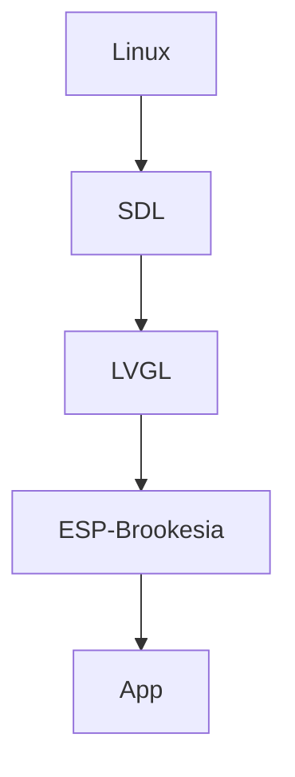

# LVGL + ESP-Brookesia 嵌入式模拟桌面应用开发

## 1.项目背景

本项目是基于 **LVGL**（轻量级多功能图形库）和 **ESP-Brookesia** 的嵌入式模拟桌面应用开发，专为嵌入式设备构建丰富的图形界面而设计。目标是为嵌入式设备提供高性能、低功耗的图形界面解决方案，适用于智能家居、工业控制、医疗设备等多种场景。

## 2.核心功能

1. **LVGL 图形组件支持**：提供丰富的图形组件（如按钮、图表、列表等），支持快速开发复杂的用户界面。
2. **ESP-Brookesia 集成**：深度优化资源占用，确保在嵌入式设备上高效运行。
3. **跨平台支持**：适配多种嵌入式硬件，提供灵活的移植方案。

## 3.目录结构

源码路径：[https://gitcode.com/aiprtem_lvgl/lv_port_sdl](https://gitcode.com/aiprtem_lvgl/lv_port_sdl)

- **/examples**：示例代码，展示 LVGL 组件的使用方法。
  - **/esp_brookesia_advanced**：ESP-Brookesia 高级功能示例。
  - **/esp_brookesia_demo**：ESP-Brookesia 基础演示示例。
  - **/widget_demo**：LVGL 组件演示示例。
- **/lvgl**：LVGL 核心库文件。
- **/lv_drivers**：LVGL 驱动程序库。
- **/esp-brookesia**：ESP-Brookesia 相关代码和配置。
- **/CMakeLists.txt**：项目构建配置文件。
- **/Makefile**：项目编译脚本。
- **/lv_conf.h**：LVGL 配置文件。
- **/lv_drv_conf.h**：LVGL 驱动程序配置文件。

## 4.项目框架

本项目基于 Linux 系统，通过 SDL 提供图形渲染支持，LVGL 作为图形库核心，ESP-Brookesia 负责嵌入式优化，最终构建出高性能的嵌入式应用。以下是各组件之间的关系框图：



- **Linux**：提供基础运行环境。
- **SDL**：处理图形渲染和输入事件。
- **LVGL**：提供丰富的图形组件和界面逻辑。
- **ESP-Brookesia**：优化资源占用，提升性能。
- **App**：最终运行的嵌入式应用。

### 4.1 ESP-Brookesia 模块介绍

ESP-Brookesia 是本项目的核心优化模块，专为嵌入式设备设计，主要功能包括：

1. **资源优化**：通过内存管理和算法优化，显著降低 LVGL 在嵌入式设备上的资源占用。
2. **性能提升**：针对嵌入式硬件特性（如低功耗 CPU、有限内存）进行专项优化，确保图形界面流畅运行。
3. **硬件适配**：提供统一的硬件抽象层，支持快速移植到不同嵌入式平台。
4. **功耗管理**：集成智能功耗控制策略，延长设备续航时间。

ESP-Brookesia 与 LVGL 深度集成，开发者无需关注底层细节即可享受性能优化。

### 4.2 esp_brookesia_advanced 用例介绍

`esp_brookesia_advanced` 是一个综合示例，展示了 ESP-Brookesia 模块的强大功能，包含以下应用：

1. **Calculator**：一个功能完整的计算器应用，支持基本运算和科学计算。
2. **Draw**：绘图工具，支持触控或鼠标输入。
3. **Game_2048**：经典的 2048 游戏，适配嵌入式设备的性能优化版本。
4. **Music Player**：音乐播放器，支持本地音频文件播放和控制。
5. **Video Player**：视频播放器，支持低分辨率视频的流畅播放。

## 5.初始化过程

#### 5.1 LVGL 以及 SDL 配置
    LVGL 初始化比较简单，可以参考下面的代码：
```cpp  
    /* initialize LVGL */
    lv_init(); 

    hal_init();
```
    hal_init参考下面的代码：
```cpp 
static void hal_init(void)
{
  /* mouse input device */
  static lv_indev_drv_t indev_drv_1;
  lv_indev_drv_init(&indev_drv_1);
  indev_drv_1.type = LV_INDEV_TYPE_POINTER;

  /* keyboard input device */
  static lv_indev_drv_t indev_drv_2;
  lv_indev_drv_init(&indev_drv_2);
  indev_drv_2.type = LV_INDEV_TYPE_KEYPAD;

  /* mouse scroll wheel input device */
  static lv_indev_drv_t indev_drv_3;
  lv_indev_drv_init(&indev_drv_3);
  indev_drv_3.type = LV_INDEV_TYPE_ENCODER;

  lv_group_t *g = lv_group_create();
  lv_group_set_default(g);

  lv_disp_t *disp = NULL;

  /* Use the 'monitor' driver which creates window on PC's monitor to simulate a display*/
  printf("Initializing SDL...\n");
  sdl_init();
  printf("SDL initialized successfully\n");

  /*Create a display buffer*/
  static lv_disp_draw_buf_t disp_buf1;
  static lv_color_t buf1_1[MONITOR_HOR_RES * 100];
  static lv_color_t buf1_2[MONITOR_HOR_RES * 100];
  lv_disp_draw_buf_init(&disp_buf1, buf1_1, buf1_2, MONITOR_HOR_RES * 100);

  /*Create a display*/
  static lv_disp_drv_t disp_drv;
  lv_disp_drv_init(&disp_drv); /*Basic initialization*/
  disp_drv.draw_buf = &disp_buf1;
  disp_drv.flush_cb = sdl_display_flush;
  disp_drv.hor_res = MONITOR_HOR_RES;
  disp_drv.ver_res = MONITOR_VER_RES;
  disp_drv.antialiasing = 1;

  disp = lv_disp_drv_register(&disp_drv);

  /* Add the input device driver */
  // mouse_init();
  indev_drv_1.read_cb = sdl_mouse_read;

  // keyboard_init();
  indev_drv_2.read_cb = sdl_keyboard_read;

  // mousewheel_init();
  indev_drv_3.read_cb = sdl_mousewheel_read;


  /* Set diplay theme */
  lv_theme_t * th = lv_theme_default_init(disp, lv_palette_main(LV_PALETTE_BLUE), lv_palette_main(LV_PALETTE_RED), LV_THEME_DEFAULT_DARK, LV_FONT_DEFAULT);
  lv_disp_set_theme(disp, th);

  /* Tick init */
  // end_tick = false;
  // pthread_create(&thr_tick, NULL, tick_thread, NULL);

  /* register input devices */
  lv_indev_t *mouse_indev = lv_indev_drv_register(&indev_drv_1);
  lv_indev_t *kb_indev = lv_indev_drv_register(&indev_drv_2);
  lv_indev_t *enc_indev = lv_indev_drv_register(&indev_drv_3);
  lv_indev_set_group(kb_indev, g);
  lv_indev_set_group(enc_indev, g);

  /* Set a cursor for the mouse */
  LV_IMG_DECLARE(mouse_cursor_icon);                   /*Declare the image file.*/
  lv_obj_t * cursor_obj = lv_img_create(lv_scr_act()); /*Create an image object for the cursor*/
  lv_img_set_src(cursor_obj, &mouse_cursor_icon);      /*Set the image source*/
  lv_indev_set_cursor(mouse_indev, cursor_obj);        /*Connect the image  object to the driver*/
}
```

#### 5.2 LVGL Tick获取函数
    custom_tick_get函数是获取系统的毫秒时间，由于LVGL使用毫秒进行动画控制，所以需要设置，可以参考下面的代码：

```cpp
extern "C" {

/*Set in lv_conf.h as `LV_TICK_CUSTOM_SYS_TIME_EXPR`*/
uint32_t custom_tick_get(void)
{
    static uint64_t start_ms = 0;
    if(start_ms == 0) {
        struct timeval tv_start;
        gettimeofday(&tv_start, NULL);
        start_ms = (tv_start.tv_sec * 1000000 + tv_start.tv_usec) / 1000;
    }

    struct timeval tv_now;
    gettimeofday(&tv_now, NULL);
    uint64_t now_ms;
    now_ms = (tv_now.tv_sec * 1000000 + tv_now.tv_usec) / 1000;

    uint32_t time_ms = now_ms - start_ms;
    return time_ms;
}

}
```

PS：由于LVGL是一个C语言库，所以custom_tick_get函数应该放在extern C代码段，否则，LVGL将找不到这个函数。

#### 5.3 LVGL触摸屏驱动移植和适配
    请参考[LVGL移植到AM335x+Linux系统](https://blog.csdn.net/prtem/article/details/145792569》)

####  5.4 esp_brookesia 以及 app初始化
以下是 `esp_brookesia_advanced` 的初始化代码片段（摘自 `main.cpp`）：

```cpp
void esp_brookesia_demo_init(void)
{
    printf("Display ESP-Brookesia phone demo");
    ESP_Brookesia_Phone *phone = new ESP_Brookesia_Phone();
    ESP_BROOKESIA_CHECK_NULL_EXIT(phone, "Create phone failed");

    // 根据屏幕分辨率加载样式表
    if ((BSP_LCD_H_RES == 1024) && (BSP_LCD_V_RES == 600)) {
        stylesheet = new ESP_Brookesia_PhoneStylesheet_t ESP_BROOKESIA_PHONE_1024_600_DARK_STYLESHEET();
    } else if ((BSP_LCD_H_RES == 1280) && (BSP_LCD_V_RES == 800)) {
        stylesheet = new ESP_Brookesia_PhoneStylesheet_t ESP_BROOKESIA_PHONE_1280_800_DARK_STYLESHEET();
    } else if ((BSP_LCD_H_RES == 800) && (BSP_LCD_V_RES == 1280)) {
        stylesheet = new ESP_Brookesia_PhoneStylesheet_t ESP_BROOKESIA_PHONE_800_1280_DARK_STYLESHEET();
    }

    // 安装应用
    Calculator *calculator = new Calculator();
    ESP_BROOKESIA_CHECK_NULL_EXIT(calculator, "Failed to create calculator");
    ESP_BROOKESIA_CHECK_FALSE_EXIT((phone->installApp(calculator) >= 0), "Failed to begin calculator");

    Drawpanel *drawpanel = new Drawpanel();
    ESP_BROOKESIA_CHECK_NULL_EXIT(drawpanel, "Failed to create drawpanel");
    ESP_BROOKESIA_CHECK_FALSE_EXIT((phone->installApp(drawpanel) >= 0), "Failed to begin drawpanel");

    Game2048 *game_2048 = new Game2048(BSP_LCD_H_RES, BSP_LCD_V_RES-50);
    ESP_BROOKESIA_CHECK_NULL_EXIT(game_2048, "Failed to create game_2048");
    ESP_BROOKESIA_CHECK_FALSE_EXIT((phone->installApp(game_2048) >= 0), "Failed to begin game_2048");

    MusicPlayer *music_player = new MusicPlayer();
    ESP_BROOKESIA_CHECK_NULL_EXIT(music_player, "Failed to create music_player");
    ESP_BROOKESIA_CHECK_FALSE_EXIT((phone->installApp(music_player) >= 0), "Failed to begin music_player");

    AppVideoPlayer *app_video_player = new AppVideoPlayer(BSP_LCD_H_RES, BSP_LCD_V_RES);
    ESP_BROOKESIA_CHECK_NULL_EXIT(app_video_player, "Failed to create app_video_player");
    ESP_BROOKESIA_CHECK_FALSE_EXIT((phone->installApp(app_video_player) >= 0), "Failed to begin app_video_player");
}
```

这些应用通过 LVGL 和 ESP-Brookesia 的深度集成，展示了高性能嵌入式图形界面的实现方式。

## 6 快速开始

### 6.1 环境准备

确保系统满足以下依赖项：

- Ubuntu 20.04
- SDL2 开发库（可通过 `sudo apt-get install libsdl2-dev` 安装）
- Git
- CMake
- GCC

### 6.2 获取源码

```bash
git clone https://gitcode.com/aiprtem_lvgl/lv_port_sdl.git
cd lv_port_sdl
```

### 6.3 下载子模块

```bash
git submodule update --init --recursive
```

### 6.4 编译项目

```bash
mkdir build && cd build
cmake ..
make
make install
```

可执行文件默认安装在 `out` 目录下。如需自定义输出目录，请修改 `cmake` 中的 `CMAKE_INSTALL_PREFIX` 变量。

### 6.5 运行示例

```bash
cd out/lv_port_sdl/bin/
./esp_brookesia_advanced
```

**注意**：此示例依赖 `SDL2`，若未安装可能导致无法启动。


## 7 总结

本项目为嵌入式开发者提供了一个强大的图形界面开发平台，结合 LVGL 的灵活性和 ESP-Brookesia 的高效性，能够快速构建高性能的嵌入式应用。通过示例代码和详细的文档，开发者可以轻松上手并扩展功能。
